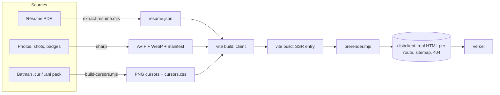

<div align="center">


# RITHWIK BANDI

### Web developer & growth expert. Built like a product, staged like a poster.

**[rithwikbandi.tech](https://rithwikbandi.tech)**


</div>

---

## The idea

Most portfolios are a template with a name on it. This one is a **single, committed art direction** (the blood-red, soot-black mood of *The Batman*, 2022) engineered to the standard of a shipped product: statically prerendered, 3D where it earns its place, native cursors with zero input lag, and a résumé page that **rebuilds itself from a PDF**.

No UI framework. No animation library. No analytics. One hand-written stylesheet system, one small React app.

## What makes it different

| | |
|---|---|
| 🦇 **Poster hero + real 3D** | Heavy display type scratched like a film poster, with an extruded 3D bat and drifting embers (three.js) behind a pinned "case file" profile card. The 3D is its own lazy chunk: it loads after first paint, skips low-memory and data-saver devices, pauses off-screen, and lowers its own quality if frames run long. |
| 🖱️ **Native Batman cursors** | The full cursor pack, converted to 1x/2x PNG cursors with correct hotspots. They are *native CSS cursors* drawn by the OS: no JavaScript, **zero input lag**. Hand on every clickable, I-beam in fields, pen in the message box, forbidden bat on disabled controls, resize / move / help / precision states, plus two animated bats (working in the background, busy while the form sends). |
| 📄 **A résumé that builds itself** | Drop a new PDF into `public/assets/resume/` and push. A build step reads the PDF itself (headings, bold, bullets, dates, links, two-column skills) and the `/resume` page re-renders in the site's theme. No résumé text lives in the code. |
| 🖼️ **Photo viewer on native `<dialog>`** | The Vietnam exchange gallery opens with a shared-element morph from the tile into full screen (about 0.26 s). Swipe on touch, arrow keys on desktop, thumbnail rail, click or tap anywhere outside the photo to close, and the browser's back gesture closes it instead of leaving the page. |
| 🎞️ **Route transitions** | The View Transitions API morphs a project's preview from the home page into its case study, behind a red diagonal wipe. Plain navigation where unsupported. |
| ⚡ **Fast by construction** | Prerendered HTML with the CSS inlined, two preloaded fonts, AVIF/WebP at several widths with intrinsic dimensions (no layout shift), scroll-driven animations on the compositor, and only `transform` and `opacity` ever animate. |

## Measured

Taken on the current production build, served locally.

| | |
|---|---|
| Lighthouse (mobile): accessibility / best practices / SEO / agentic browsing | **100 / 100 / 100 / 100** |
| Initial JavaScript, gzip | **77 KB** |
| Stylesheet (inlined into the HTML), gzip | **10.5 KB** |
| Prerendered home page HTML, gzip | **19 KB** |
| 3D scene chunk (lazy, after first paint), gzip | 139 KB |
| Third-party requests on page load / analytics / cookies | **0** (the contact form calls its mail API only when you press send) |

## How it is built



| Concern | Approach |
|---|---|
| **Rendering** | `vite build` (client) + `vite build --ssr`, then `scripts/prerender.mjs` renders every route to real HTML, injects per-page SEO tags, inlines the CSS, preloads fonts and the first cursors, and writes `404.html` and `sitemap.xml`. The client hydrates. |
| **Routes** | `/`, `/work/jobspace`, `/work/cardioml`, `/work/sru-timetable`, `/work/folio`, `/resume`. A new project is one entry in `src/data/projects.js`; its case study, sitemap entry and metadata are generated from it. |
| **Motion** | CSS only. Scroll reveals and the progress line use scroll-driven animations (`animation-timeline`); one shared `IntersectionObserver` is the Firefox fallback. Pointer parallax and 3D tilt are transform-only on their own GPU layers. Everything resolves instantly under `prefers-reduced-motion`. No `backdrop-filter`, no blur, no infinite loops. |
| **Images** | `source-assets/` holds originals (never shipped). `npm run images` writes responsive AVIF and WebP into `public/img/` with an `images.json` manifest; `Picture.jsx` emits `srcset` and intrinsic size. |
| **Fonts** | Self-hosted variable woff2 (Archivo, Geist, Geist Mono), latin subset, `font-display: swap`. |
| **SEO** | Canonical URLs, Open Graph and Twitter cards, JSON-LD (`Person`, `WebSite`, `BreadcrumbList`), `sitemap.xml`, `robots.txt`, `llms.txt`. |
| **Accessibility** | Semantic landmarks, skip link, visible focus, real buttons and dialogs, labelled controls, contrast checked against the red, reduced-motion support throughout. |

<details>
<summary><b>Deep dive: the cursor engine</b></summary>

<br />

The Batman cursor pack ships as Windows `.cur` / `.ani` files, which browsers cannot read. `npm run cursors` decodes them with a small custom decoder (DIB and AND-mask, PNG-embedded frames, ANI RIFF), upscales with nearest-neighbour so the pixel art stays crisp, adds a thin light outline so black bats stay visible on dark and red, and writes:

- `public/cursors/*.png` and `@2x.png`, with the original hotspots
- `src/styles/cursors.css`, using `image-set()` with plain `url()` fallbacks, **generated**, never hand-edited
- `src/data/cursors.json`, the animated frames

Because they are CSS cursors, the OS draws them: no event listeners, no rAF loop, no lag. The two animated bats are the only JavaScript, and they are built not to cost anything while idle: "working" is a single static frame set once, and "busy" is drawn on **one** overlay node, so a frame change never restyles the page. Both have hard time limits and are cleared on back/forward navigation. Images preload on idle so the first hover never waits on the network.

States can be opted into with attributes: `data-cursor="pointer | default | help | crosshair | move | ew-resize | ns-resize | nwse-resize | nesw-resize"`.

</details>

<details>
<summary><b>Deep dive: the résumé that rebuilds itself</b></summary>

<br />

`scripts/extract-resume.mjs` runs before every `dev` and `build`. It reads `public/assets/resume/Rithwik_Resume.pdf` with pdf.js and recovers structure from the file itself:

- **Headings** from font size, **titles** and **bold phrases** from font names
- **Bullets** from bullet glyphs, **dates** from right-aligned text, **links** from PDF annotations
- Icon fonts are told apart from text (a font that only ever draws single characters), and two-column lists are followed column by column
- Line-break hyphens are repaired only when the joined word is used elsewhere in the document

The result is `src/data/resume.json`, which the `/resume` page renders. If the file cannot be parsed into a name and at least two sections, the page falls back to links to the PDF instead of showing broken content. The PDF is served with `must-revalidate`, so the original and the page never disagree.

**To update:** replace the PDF, commit, push.

</details>

<details>
<summary><b>Deep dive: the photo viewer</b></summary>

<br />

Built on the native `<dialog>`, so the focus trap, inert page, <kbd>Esc</kbd> and focus return come from the browser.

- **Open / close:** a view transition morphs the tile's photo into the viewer and back. Only one element may carry the shared name at a time, scroll is locked behind `scrollbar-gutter: stable` so the viewport never changes mid-transition, and the project previews' own transition names are switched off for it.
- **Close anywhere:** a click outside the photo's *rectangle* (checked geometrically, because its container spans the stage), <kbd>Esc</kbd>, the close button, or the back gesture. Opening adds exactly one history entry and closing removes it, so history stays balanced.
- **Touch:** the photo follows the finger and either commits or springs back; the tap that ends a swipe never counts as "outside".
- **Fast:** images are requested only on open, a tiny cached copy shows instantly while the large one loads, neighbours are warmed, and tiles warm their big version on hover.

</details>

## Run it

```bash
npm install
npm run dev        # dev server (extracts the résumé first)
npm run build      # résumé -> client -> SSR -> prerender   (output: dist/client)
npm run preview    # serve the real prerendered output on :4173
npm run images     # regenerate responsive AVIF/WebP from source-assets/
npm run cursors    # regenerate the Batman cursor set and cursors.css
npm run resume     # re-extract resume.json from the PDF
```

## Layout

```
src/
  data/         site.js, projects.js (all copy), resume.json / images.json / cursors.json (generated)
  components/   Nav, Footer, HeroScene (3D), PhotoViewer, Plate, SampleTimetable, Picture, TLink, ...
  sections/     Hero, Work, About, Capabilities, Training, Beyond, Contact
  pages/        Home, CaseStudy, Resume, NotFound
  styles/       tokens, base, components, sections, resume, viewer, cursors (generated)
  cursor.js     the two animated cursors (static "working", overlay-based "busy")
  meta.js       per-route title, description and JSON-LD (prerender and client)
scripts/        extract-resume, optimize-images, build-cursors, prerender
source-assets/  originals, never shipped
```

## Principles

- **Say only what is true.** Nothing is claimed that a project's own README or live product does not support: no invented usage numbers, traffic or impact figures.
- **Private work stays private.** Company and client work is not named; it appears only as one generic line.
- **Nothing animates for free.** If an effect costs frames, it is removed or made to pay for itself.
- **The browser first.** Native `<dialog>`, native cursors, native view transitions, scroll-driven animation: platform features before libraries.

## Deploy

Vercel. `vercel.json` sets `outputDirectory` to `dist/client`, `cleanUrls`, immutable caching for hashed assets, revalidation for the résumé PDF, and basic security headers. Build command: `npm run build`.

## Credits

- Batman cursor set: public domain, by THTH.
- The bat emblem is an original path, not an official logo. This is an independent portfolio with a film-inspired look; it is not affiliated with or endorsed by Warner Bros. or DC.
- Typefaces: Archivo, Geist and Geist Mono, under their open licences.

<div align="center">

<br />

**Designed and built by [Rithwik Bandi](https://rithwikbandi.tech).**

© 2026

</div>
